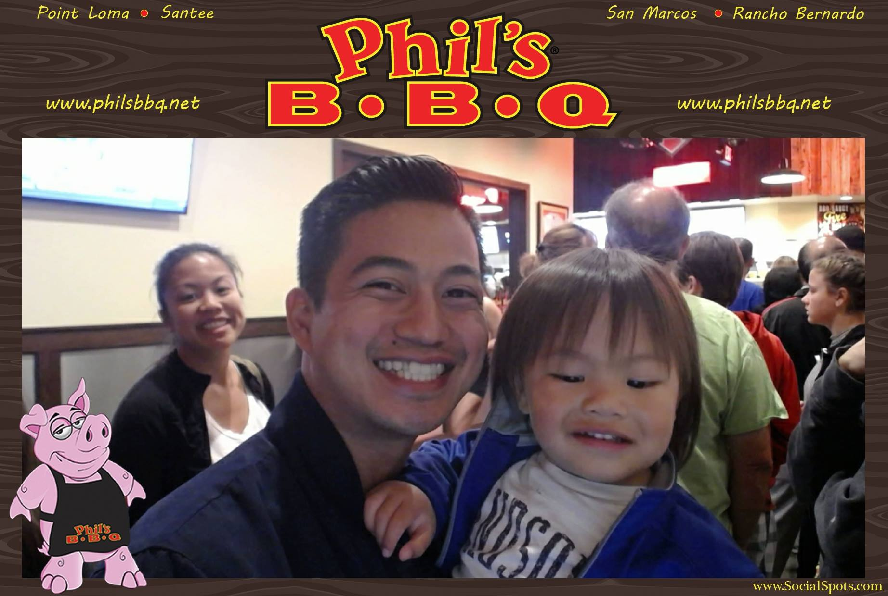

{:.avatar}

#Danilo Carandang
Aspiring Full Stack Javascript  and Hybrid Mobile App Developer

<a href="mailto:">DCarandangSSF@SoftStackFactory.org</a>
|
<i class="fa fa-github"></i> <a href="https://github.com/dcarandangssf">DCarandangSSF</a>
|
<i class="fa fa-twitter"></i> <a href="https://twitter.com/DVCarandangJr">@DVCarandangJr</a>

## Currently

I'm a student at SoftStack Factory, due to finish around January 2017. During my bootcamp I've taken up an interest in mobile technologies and web development.

## Education

`Fall 2016-17`
__SoftStack Factory - San Diego, CA__ Certificate of completion

`Spring 2016`
__Miramar Community College - San Diego, CA__ Certificate of Performance:Music Production and Engineering : Music
 Continuing education in Music production and Engineering

`Spring 2005`
__Mt. Carmel High School - San Deigo, CA__ High School Diploma

## Technical skills

* HTML and CSS
* Javascript
* Angular 1 & 2
* Node.js
* Express.js
* MongoDB
* Ionic 1 & 2

## Projects

### CV

I created a this web page to show off my CV.

Midterm Project - Weather Watcher App

IdSentral Website

## Achievements

Customer Service 
Researched, calmed and rapidly resolved client conflicts to prevent loss of key accounts.

Customer Interface 
Greeted customers upon entrance and handled personal and merchant account transactions, wires, safe deposit
box access, recording, and surrendering.
Assisted customers over the phone regarding store operations, product, promotions and questions.

## Experience

`2014-16`
__Pizza Hut - Delivery Driver__

Providing exceptional customer service in store and on delivery in a safe and timely manner.
Actively taking initiative in learning multiple facets of the job working as a team member performing cashier duties,
product assistance and cleaning.

`2015-16`
__Three Treasures Cultural Arts Society - Assisstant Program Coordinator, Music Teacher__ 

 Worked during the school year as the assisstant program coordinator for Crown Point Junior Music Academy and as the music teacher.
 Taught elementary school students the fundamentals of music theory and how to play the ukulele during the normal school year and the piano over the summer.

`2009-14`
__Union Bank - Senior Teller__ 

Responsible for completing customers transactions in a timely manner and guaranteeing high level of customer service.
Recommended, selected and helped locate products based on customer needs and desires.
Regularly sought opportunities to up sell and add on additional merchandise.
Processed and issued cashier's checks and money orders for customers.

## Hobbies

* Coding
* Cooking
* Learning
* PodCast
* Personal Development

## Links

* <i class="fa fa-envelope"></i> <a href="mailto:">DCarandangSSF@SoftStackFactory.org</a> 
* <i class="fa fa-github"></i> <a href="https://github.com/dcarandangssf">DCarandangSSF</a> 
* <i class="fa fa-twitter"></i> <a href="https://twitter.com/DVCarandangJr">@DVCarandangJr</a> 
